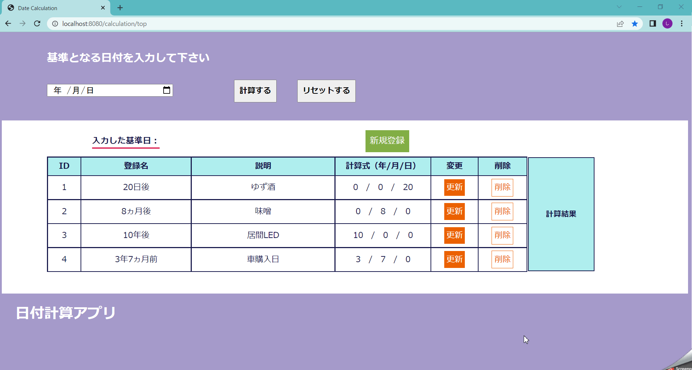
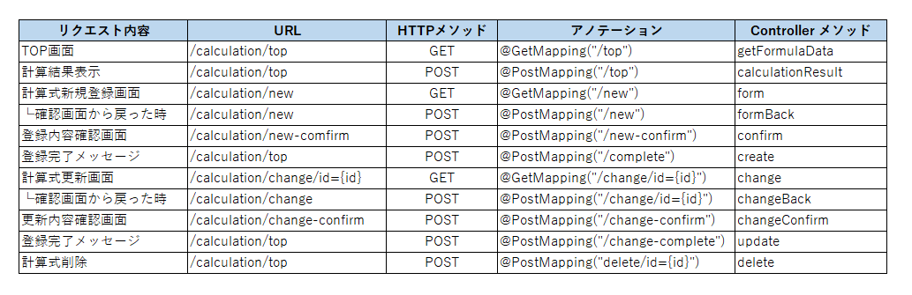

# 日付計算アプリ
第７〜１０回課題 CRUDアプリ

## 概要
入力した基準日を元にDB内にある計算式にて日付を計算するアプリです。 
計算式の新規登録、更新、削除機能があります。

## 機能一覧
* 計算式の一覧表示
* 基準日からの日付計算結果表示
* 計算式の新規登録
* 計算式の更新
* 計算式の削除

## 画面一覧
1. TOP画面（基準日入力フォーム、登録済計算式リスト）
2. 新規登録画面、入力内容確認画面
3. 新規登録画面、入力内容確認画面

## URL設計

## 使用技術
* Java 11
* Spring 2.6.7
* MySQL 8.0.28
* Thymeleaf
* MyBtatis 2.2.2
